# Acceso remoto VNC

# 1. Introducción.

* Práctica de conexiones remotas con VNC
* Deberemos conectarnos por VNC de la siguiente manera
    1. Acceder a Windows - desde Windows 7/10
    2. Acceder a Windows - desde GNU/Linux OpenSUSE
    3. Acceder a GNU/Linux OpenSUSE - desde GNU/Linux OpenSUSE
    4. Acceder a GNU/Linux OpenSUSE - desde Windows 7/10
---

# 2. Instalación y configuración de *TightVNC* desde Window.

### 2.1 WindowServer

Vamos a la web oficial de *TightVNC* y nos descargamos la última versión.

Abrimos el instalador y comenzamos con la instalación

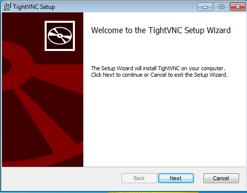

Como vamos a usar este window como servidor para hacer las pruebas, le damos a custom para elegir las opciones correctas.

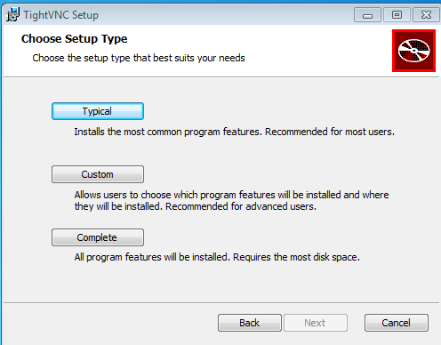

Dentro de Custom, desactivamos el TightVNC Viewer y le damos a siguiente.

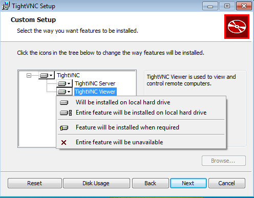

Dejamos las opciones por defecto, si no tenemos marcada la opción de añadir exepción al firewall la marcamos.

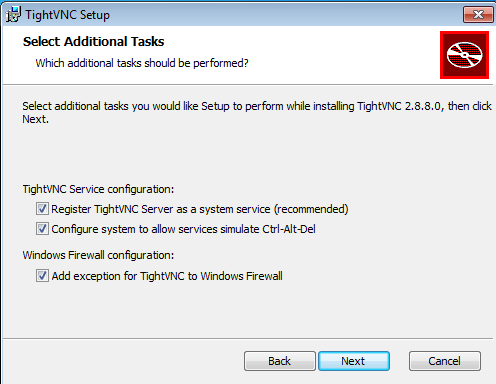

Ya con el programa configurado, le damos a instalar.

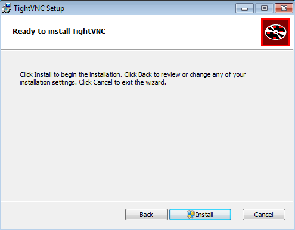

Configuramos las claves para acceder al server y las claves de administrador.

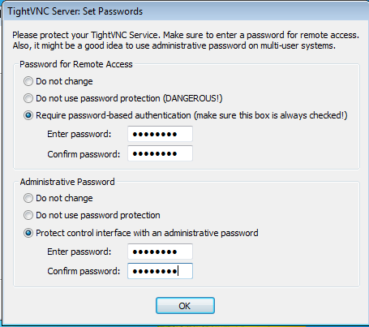

*Ya tenemos la instalación terminada en el servidor.*

### 2.2 Comprobación desde la máquina real.

+ Ejecutamos `nmap -Pn IP-VNC-SERVER`, desde la máquina real GNU/Linux para comprobar
que los servicios son visibles desde fuera de la máquina VNC-SERVER

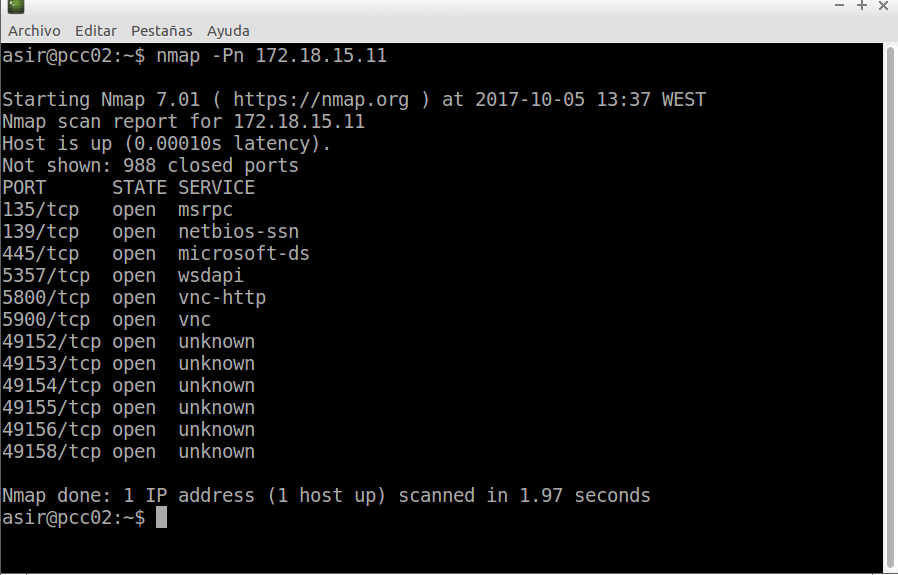

### 2.3 WindowCliente.

Ahora, desde el cliente de window, hacemos la misma instalación pero en la ventana del Setup, le damos a custom y esta vez desactivamos la opción *TightVNC*.

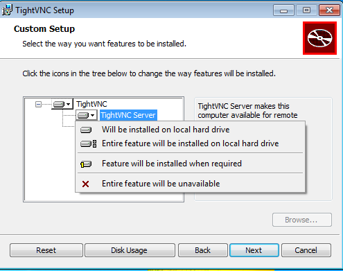

Seguimos con la instalación estándar

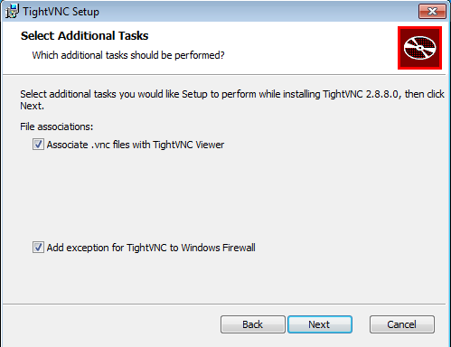

Finalizamos la instalación en el cliente.

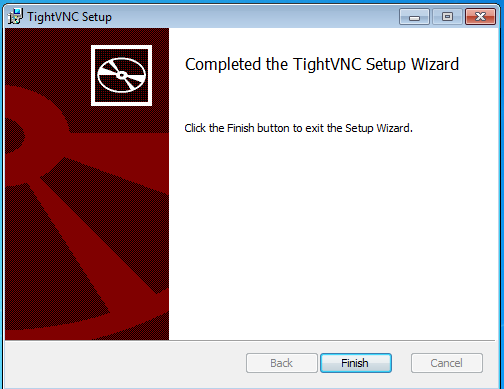

*Ya tenemos la instalación terminada en el cliente*

### 2.4 Comprobando conectividad entre window cliente y window server.

Abrimos el programa instalado y ponemos la ip y el puerto para conectarnos.

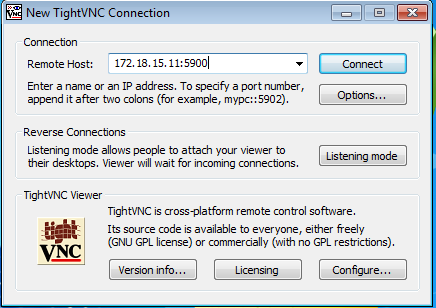

ponemos la contraseña configurada en la configuración del programa en el window server.

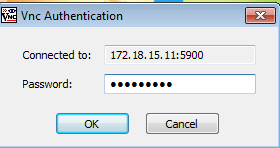

Como podemos comprobar, podemos acceder desde el cliente al servidor por VNC.

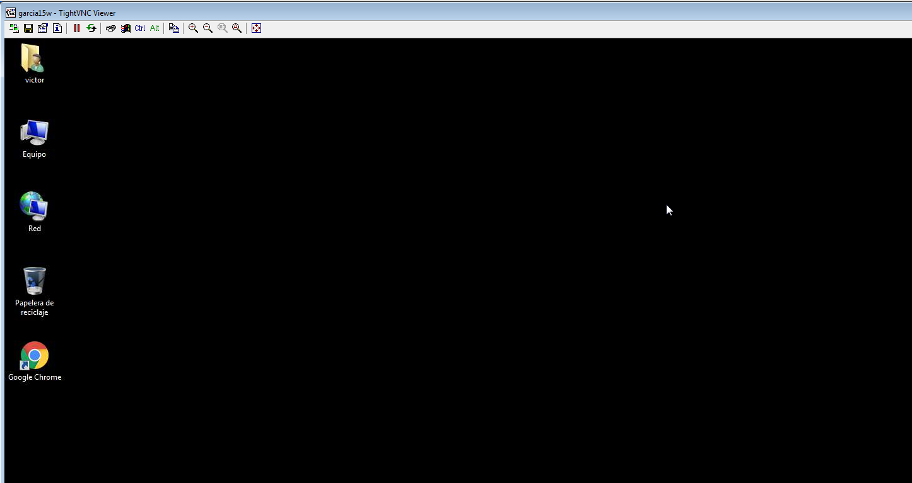

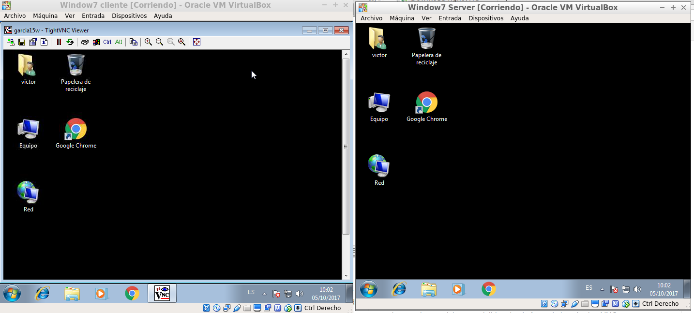

Comprobamos desde el servidor, las conexiones remota con `netstat -n`

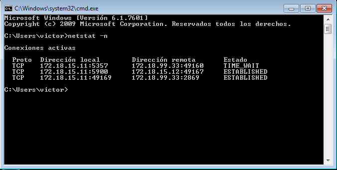

---

# 3. Instalación y configuración desde OpenSUSE.

### 3.1 OpenSUSE Server

+ En opensuSe, vamos a *yast, permitir conexión remota* y seguimos la siguiente configuración:

Como este OpenSuse lo vamos a usar como servidor, marcamos la opción *Permitir administración remota con gestión del sistema*

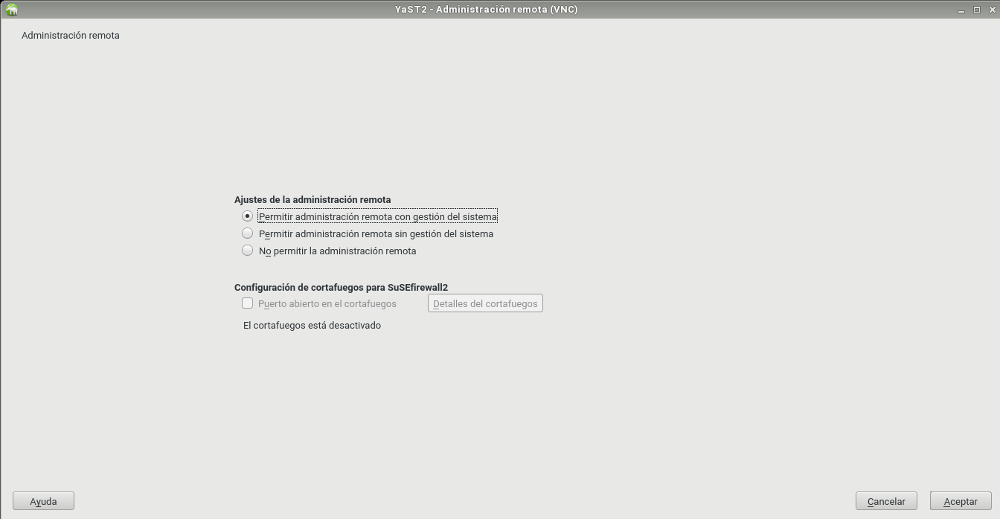

le damos a aceptar y ya tenemos lista la conexión remota en el servidor.

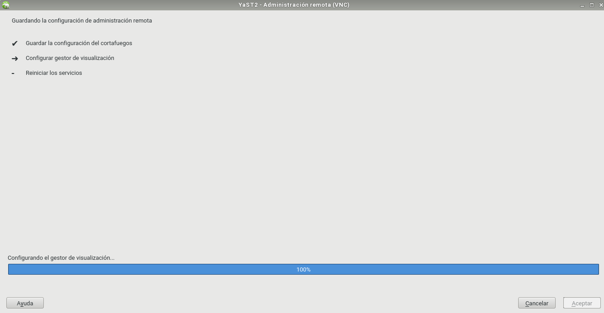

### 3.2 Ejecutar Comprobación desde la máquina real.

+ Ejecutamos `netstat -ntap` para comprobar que están los servicios en los puertos 5801 y 5901.

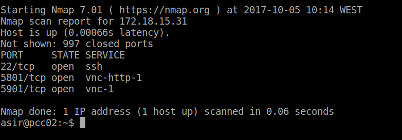

+ Ejecutamos `ps -ef|grep vnc` para comprobar que los servicios relacionados con vnc están en ejecución.

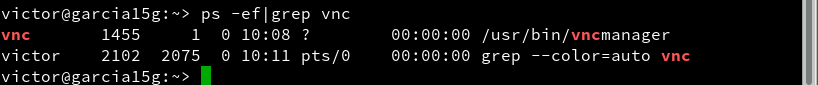

### 3.3 OpenSUSE Cliente

Ahora hacemos lo mismo pero en el cliente, con la diferencia de que marcamos la opción, *Permitir administración remota sin gestión del sistema*, Ya tenemos el cliente preparado para conectarnos al servidor.

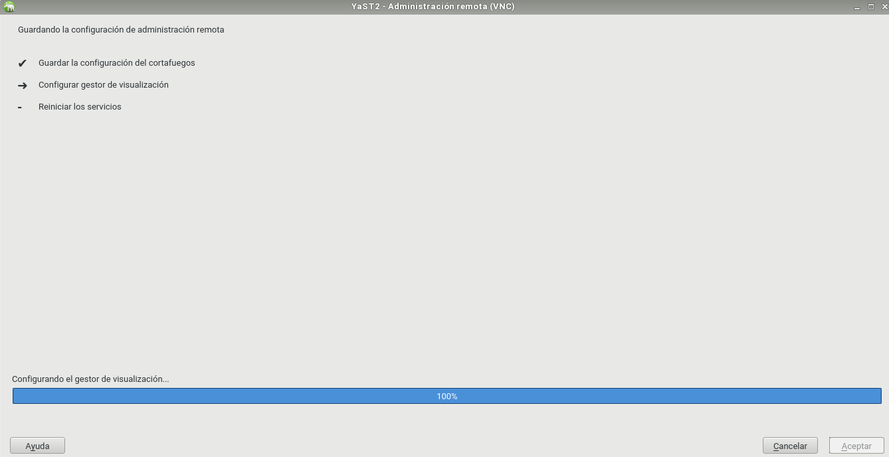

Abrimos la consola y escribimos vncviewer, ponemos la IP/Puerto del servidor y la contraseña.

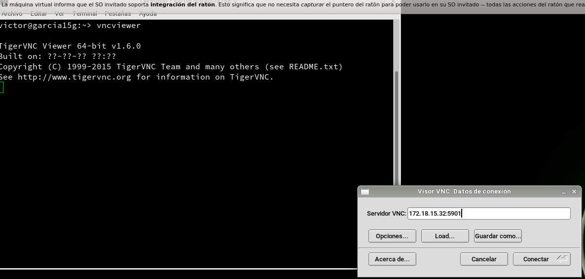

Como podemos comprobar, ya podemos conectarnos desde el cliente al servidor.

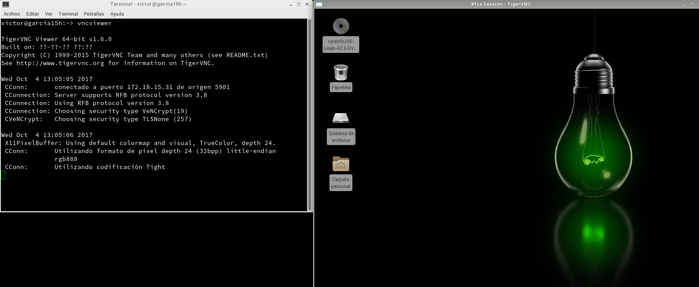

### 4. Comprobaciones finales

+ Por último vamos a probar la conectividad entre servidores window y cliente OpenSUSE y viceversa.

### 4.1 Comprobación de Window a OpenSUSE

Abrimos el programa *TightVNC* en el cliente Window y ponemos la IP/Puerto del servidor OpenSUSE.

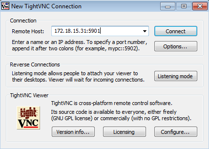

Como podemos comprobar, nos conectamos perfectamente.

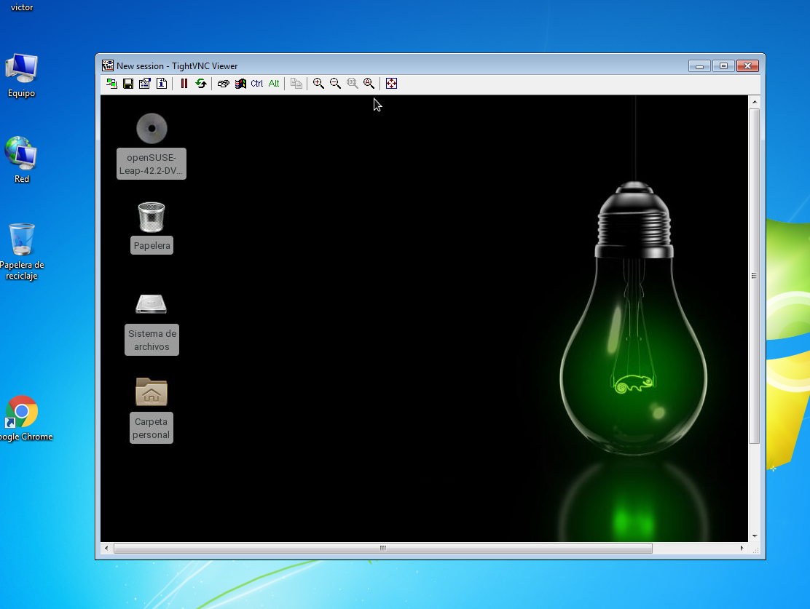

### 4.2 Comprobación de OpenSUSE a Window

Abrimos un Terminal en el cliente OpenSUSE y ponemos `vncviwer IP del Servidor Window`

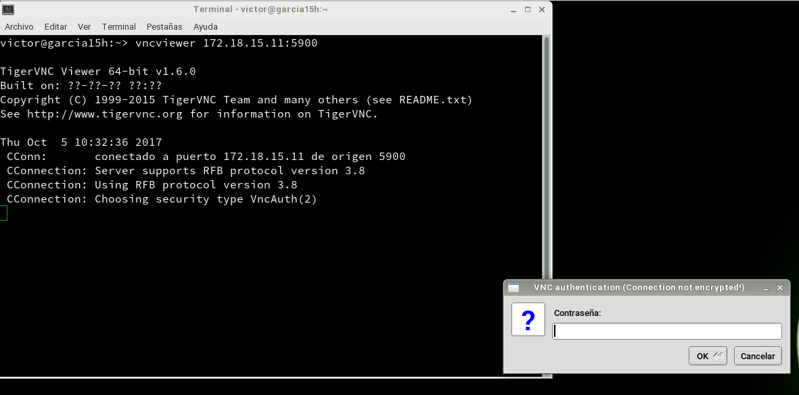

Ponemos la contraseña configurada y como podemos comprobar, estamos dentro del servidor window

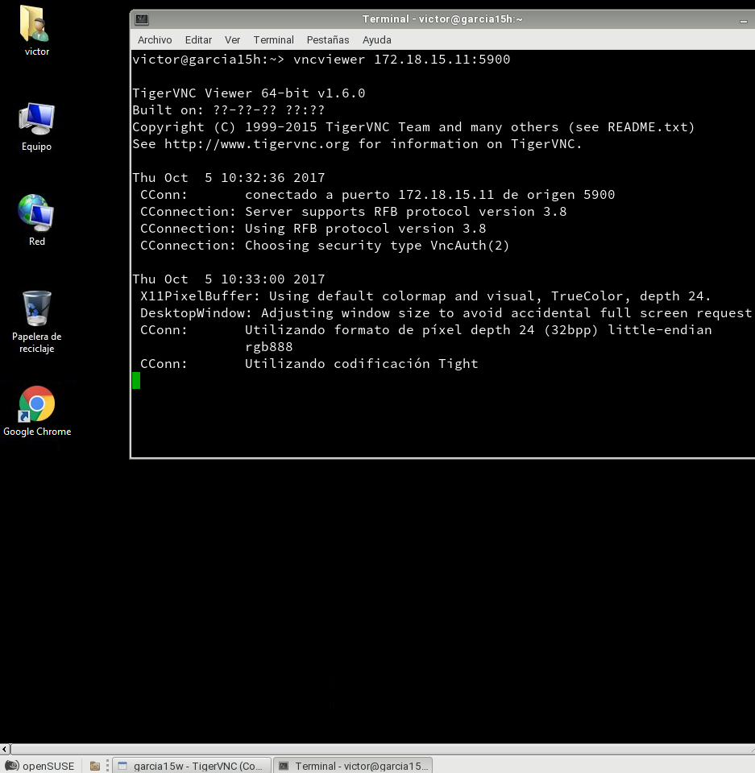

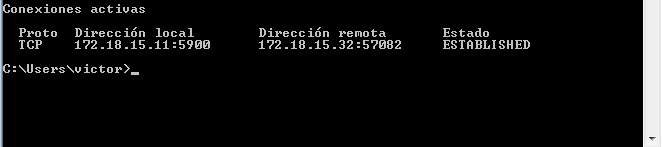

---
